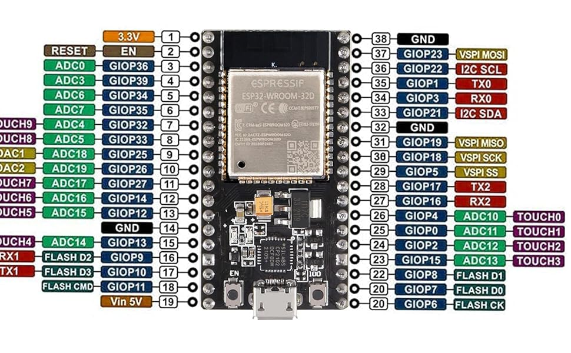

# Notes

## Dev Board



For this project, I'm using a [ESP32 Dev Board](http://www.hiletgo.com/ProductDetail/1906566.html) from HiLetgo.

In the Arduino IDE, select the "ESP32 Wrover Module" board. The built-in LED is GPIO 2.

When viewing the ESP32 from the top, with the USB port pointed down, the IO0 button is on the right side of the board, and the reset button is on the left side of the board. On my board, IO0 is labeled "IO0", and the reset button is labeled "EN".

### Upload Procedure

1. Press upload in the Arduino IDE.
2. Wait until you see "Connecting..." in the output panel.
3. Press and hold the IO0 button on the ESP32.
4. Press and release the reset button.
5. Release the IO0 button.


## NeoPixel Ring

The NeoPixel ring requires three connections to the ESP32:

| NeoPixel | ESP32 |
|----------|-------|
| 3.3V     | 3.3V  |
| GND      | GND   |
| IN       | GPIO 4|

## Frame

The film used to tint the glass is [Daytime Privacy and Heat Control Mirror Silver 5 (Very Dark)](https://buydecorativefilm.com/products/bdf-s05-window-film-one-way-mirror-silver-5) from Buy Decorative Film. The idea was to create a soft of "two-way" mirror effect, where the LEDs are visible through the glass, but the glass is reflective when the LEDs are off.

```
$ arduino-cli lib install "Adafruit NeoPixel"
$ arduino-cli compile --fqbn esp32:esp32:esp32wrover --libraries ./lua
$ arduino-cli upload -p /dev/ttyUSB0 --fqbn esp32:esp32:esp32wrover
```